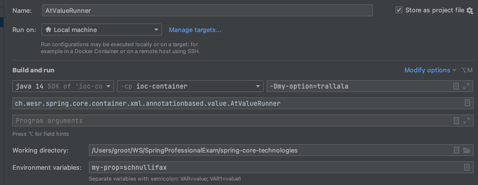

= Spring Bean annotation based container configuration Beispiel
:sourcedir: ../src/main/java
:resourcedir: ../src/main/resources
:docudir: ..
:toc:
:sectnumlevels: 4

In der annotation-based Konfiguration von Spring Framework, gibt es die Möglichkeit eine Bean-Konfiguration in eine Komponentenklasse zu verschieben, anstatt XML für die Beschreibung der Bean-Verdrahtung zu verwenden. Dies geschieht durch die Verwendung von Annotationen für die entsprechende Klasse, Methode oder Felddeklaration.
Die Annotation Injection geschieht bevor der XML Injection. Somit überschreibt die XML Injection die Annotations-Eigenschaften.

== Das <context:annotation-config/> Element in der XML Konfiguration

Mit dem *<context:annotation-config/>* XML Element und dem dem *context* Namespace

* http://www.springframework.org/schema/context
* https://www.springframework.org/schema/context/spring-context.xsd

werden implizit folgende PostProcesserBeans registriert

* ConfigurationClassPostProcessor
* RequiredAnnotationBeanPostProcessor (deprecated)
* AutowiredAnnotationBeanPostProcessor
* CommonAnnotationBeanPostProcessor
* PersistenceAnnotationBeanPostProcessor
* EventListenerMethodProcessor

=== PostProcessors als eigenständige Beans definieren.
Wie immer kann man sich die PostProcesser Beans als individuelle Beans definieren
link:{resourcedir}/dependencies/annotation-based/autowired-annotation-bean-post-processor.xml[AutowiredAnnotationBeanPostProcessor Konfiguration Metadata]

[source, xml]
----
<!-- der PostProcessor für die Autowrire Injection -->
<bean class="org.springframework.beans.factory.annotation.AutowiredAnnotationBeanPostProcessor"/>
<!-- weitere bean definitions ab hier -->
----
Sieh das ganze Beispiel hier link:{sourcedir}/ch/wesr/spring/core/container/xml/annotationbased/autowired/AutowiredAnnotationBeanPostProcessorRunner.java[AutowiredAnnotationBeanPostProcessorRunner]

== Annotationen

Folgende Annotationen werde ich in diesem Abschnit beleuchten:

* @Required
* @Autowired
* @Qualifier
* JSR-250 Annotations (@Resource, @PreDestroy und @PostConstruct)

== @Required (deprecated)
`Die @Required-Annotation und der RequiredAnnotationBeanPostProcessor sind ab Spring Framework 5.1 formal deprecated, zugunsten der Verwendung von Konstruktorinjektion`

Daher keine weiteren Ausführungen zu diesem Thema an dieser Stelle.

== @Autowired
=== Ein einfaches Beispiel
==== link:{resourcedir}/dependencies/annotation-based/annotation-based.xml[Konfig Metadata]

[source,xml]
----
<?xml version = "1.0" encoding = "UTF-8"?>
<beans xmlns = "http://www.springframework.org/schema/beans"
       xmlns:xsi = "http://www.w3.org/2001/XMLSchema-instance"
       xmlns:context = "http://www.springframework.org/schema/context"
       xsi:schemaLocation = "http://www.springframework.org/schema/beans
      http://www.springframework.org/schema/beans/spring-beans-3.0.xsd
      http://www.springframework.org/schema/context
      http://www.springframework.org/schema/context/spring-context-3.0.xsd">
    <context:annotation-config/>
    <!-- bean definitions go here -->
    <bean id="springBeanExplorer" class="ch.wesr.spring.core.container.xml.annotationbased.autowired.SpringBeanExplorer"/>
    <bean id="springBean" class="ch.wesr.spring.core.container.xml.annotationbased.autowired.SpringBean"/>
</beans>
----

==== link:{sourcedir}/ch/wesr/spring/core/container/xml/annotationbased/autowired/SpringBean.java[SpringBean]

[source,java]
----
public class SpringBean {

    private String objectName;
    private String klasse;

    public String getObjectName() {
        return objectName;
    }

    public void setObjectName(String objectName) {
        this.objectName = objectName;
    }

    public String getKlasse() {
        return klasse;
    }

    public void setKlasse(String klasse) {
        this.klasse = klasse;
    }
}
----

==== link:{sourcedir}/ch/wesr/spring/core/container/xml/annotationbased/autowired/SpringBeanExplorer.java[SpringBeanExplorer]
Die @Autowired Annotation steht in folgendem Beispiel auf dem Attribut. Sie könnte aber ebenso gut auf der Setter Methode sein. Persönlich bin ich an die Attribute Annnotation aus den SpringBoot Projekten gewöhnt.
[source, java]
----
public class SpringBeanExplorer {

    @Autowired
    private SpringBean springBean;

    public void explore() {
        springBean.setKlasse(springBean.getClass().getSimpleName());
        springBean.setObjectName("springBean");
        springBean.sayHello();
    }

    public SpringBean getSpringBean() {
        return springBean;
    }

    // @Autowired
    public void setSpringBean(SpringBean springBean) {
        this.springBean = springBean;
    }
}
----
Ab Spring Framework 4.3 ist eine @Autowired-Annotation auf einem Konstruktor nicht mehr notwendig oder zunächst nur einen Konstruktor definiert. Wenn jedoch mehrere Konstruktoren verfügbar sind und es keinen primären/default Konstruktor gibt, muss mindestens einer der Konstruktoren mit @Autowired annotiert werden, um dem Container mitzuteilen, welcher zu verwenden ist. Siehe die Diskussion über link:{docudir}/doc/dependencies/di/constructor_argument_resolution.md[Constructor Argument Resolution] für Details.

=== Ein @Autowired mit Collections Beispiel
In diesem Beispiel geht es darum, dass man auch Set, Map und Properties vom Typ Collections als Beans definieren und "injecten" kann.
Siehe auch das Beispiel link:{docudir}/doc/dependencies/configurations/collections.md[Collection Based Autowiring]

Damit man die Collections Elemente auch als Beans definieren kann, verwendet man z.B. den Namespace *util*.

==== link:{resourcedir}/dependencies/collections/collections.xml[Collections Configuration XML]

[source,xml]
----
<?xml version="1.0" encoding="UTF-8"?>
<beans xmlns="http://www.springframework.org/schema/beans"
       xmlns:xsi="http://www.w3.org/2001/XMLSchema-instance"
       xmlns:util="http://www.springframework.org/schema/util"
       xsi:schemaLocation="http://www.springframework.org/schema/beans
       http://www.springframework.org/schema/beans/spring-beans.xsd
       http://www.springframework.org/schema/util
       http://www.springframework.org/schema/util/spring-util.xsd">

    <bean id="springBean1" class="ch.wesr.spring.core.container.xml.annotationbased.autowired.collections.SpringBean1"/>
    <bean id="springBean2" class="ch.wesr.spring.core.container.xml.annotationbased.autowired.collections.SpringBean2"/>

    <util:properties id="emails" value-type="java.lang.String" local-override="true">
        <prop key="chef">chef@firlefanz.org</prop>
        <prop key="sous-chef">sous.chef@firlefanz.org</prop>
        <prop key="sous-sous-chef">sous.sous.chef@firlefanz.org</prop>
    </util:properties>

    <util:list id="beanListe" value-type="ch.wesr.spring.core.container.xml.annotationbased.autowired.collections.MeineBean">
        <ref bean="springBean2"/>
        <ref bean="springBean1"/>
    </util:list>

    <util:map id="beanMap" map-class="java.util.HashMap" key-type="java.lang.String" value-type="ch.wesr.spring.core.container.xml.annotationbased.autowired.collections.MeineBean">
        <entry key="springBean1" value-ref="springBean1"/>
        <entry key="springBean2" value-ref="springBean2"/>
    </util:map>

    <util:set id="beanSet" value-type="ch.wesr.spring.core.container.xml.annotationbased.autowired.collections.MeineBean">
        <ref bean="springBean1"/>
        <ref bean="springBean2"/>
    </util:set>

    <bean id="collectionBean" class="ch.wesr.spring.core.container.xml.annotationbased.autowired.collections.CollectionBean">
        <property name="emails" ref="emails" />
        <property name="beanMap" ref="beanMap"/>
        <property name="beanListe" ref="beanListe"/>
        <property name="beanSet" ref="beanSet"/>
    </bean>

</beans>
----

==== link:{sourcedir}/ch/wesr/spring/core/container/xml/annotationbased/autowired/collections/CollectionBean.java[CollectionBean.java]

[source, java]
----
 @Autowired
    private Properties emails;
    @Autowired
    private List<MeineBean> beanListe;
    @Autowired
    private HashMap<String, MeineBean> beanMap;
    @Autowired
    private Set<MeineBean> beanSet;

    @Autowired
    private SpringBean1 springBean1;

    @Autowired
    SpringBean2 springBean2;

    public void sayHello() {
        System.out.println("Emails");
        System.out.println("\tchef:           "+emails.get("chef"));
        System.out.println("\tsous-chef:      "+emails.get("sous-chef"));
        System.out.println("\tsous-sous-chef: "+emails.get("sous-sous-chef"));

        System.out.println("\n");
        System.out.println("Beanliste welche die Referenzen auf die SpringBeans* hält");
        beanListe.forEach(MeineBean::sayHello);
        System.out.println("\n");
        System.out.println("BeanMap:");
        springBean1 = (SpringBean1) beanMap.get("springBean1");
        springBean1.sayHello();
        springBean2 = (SpringBean2) beanMap.get("springBean2");
        springBean2.sayHello();

        System.out.println("\n");
        System.out.println("BeanSet: ");
        beanSet.forEach(MeineBean::sayHello);
    }
    // getter und setter
----

==== link:{sourcedir}/ch/wesr/spring/core/container/xml/annotationbased/autowired/collections/CollectionBeanRunner.java[CollectionBeanRunner.java]

[source, java]
----
 public static void main(String[] args) {
        ConfigurableApplicationContext context = new ClassPathXmlApplicationContext("dependencies/collections/collections.xml");
        CollectionBean collectionBean = (CollectionBean) context.getBean("collectionBean");

        collectionBean.sayHello();
    }
----

==== output
[source,text]
----
Emails
    chef:           chef@firlefanz.org
    sous-chef:      sous.chef@firlefanz.org
    sous-sous-chef: sous.sous.chef@firlefanz.org

Beanliste welche die Referenzen auf die SpringBeans* hält
Hello from SpringBean2
Hello from SpringBean1

BeanMap:
Hello from SpringBean1
Hello from SpringBean2

BeanSet:
Hello from SpringBean1
Hello from SpringBean2
----

=== Fine-tuning Annotation-based Autowiring mit @Primary

Autowiring über den Typ kann zu mehreren Bean Injection Kandidaten führen. Deshalb ist es manchme notwendig, mehr Kontrolle über den Auswahlprozess zu haben. Eine Möglichkeit, dies zu erreichen, ist die @Primary-Annotation von Spring. @Primary zeigt an, dass eine bestimmte Bean bevorzugt werden soll, wenn mehrere Beans Kandidaten sind, die in einer einwertigen Abhängigkeit autowired werden sollen. Wenn es unter den Kandidaten genau eine primäre Bean gibt, wird diese zum autowired-Wert.

==== Annotation based

====== link:{resourcedir}/dependencies/autowire/annotation-primary-autowired.xml[Annotation Primary XML Config]

Beachte den *context* Namespace über welcher das Element *<context:annotation-config/>* verwendet wird.
Zudem wird in der XML Konfiguration nur die SpringBeanConfig instantiert.
[source, xml]
----
<?xml version="1.0" encoding="UTF-8"?>
<beans xmlns="http://www.springframework.org/schema/beans"
       xmlns:xsi="http://www.w3.org/2001/XMLSchema-instance"
       xmlns:context="http://www.springframework.org/schema/context"
       xsi:schemaLocation="http://www.springframework.org/schema/beans
          https://www.springframework.org/schema/beans/spring-beans.xsd
          http://www.springframework.org/schema/context
          https://www.springframework.org/schema/context/spring-context.xsd">
    <context:annotation-config/>

    <bean id="configBean" class="ch.wesr.spring.core.container.xml.annotationbased.autowired.primary.SpringBeanConfig"/>
    <bean id="springBeanExplorer"
          class="ch.wesr.spring.core.container.xml.annotationbased.autowired.primary.SpringBeanExplorer"/>
</beans>
----
===== link:{sourcedir}/ch/wesr/spring/core/container/xml/annotationbased/autowired/primary/SpringBeanConfig.java[SpringConfigBean]

Die SpringConfigBean ist einfache Klasse, welche zunächst einmal über die @Bean Annoation 2 SpringBean Instanzen erzeugt.
Somit existieren hier 2 verschiedene Kandidaten desselben Typs, welcher in der link:{sourcedir}/ch/wesr/spring/core/container/xml/annotationbased/autowired/primary/PrimaryAnnotationRunner.java[PrimaryAnnotationRunner.java]
injected wird.
Aufgrund dieser Konstellation wird eine Exception geworfen.

`Exception in thread "main" org.springframework.beans.factory.NoUniqueBeanDefinitionException: No qualifying bean of type 'ch.wesr.spring.core.container.xml.annotationbased.autowired.primary.SpringBean' available: expected single matching bean but found 2: primaryBean,secondaryBean
at org.springframework.beans.factory.support.DefaultListableBeanFactory.resolveNamedBean(DefaultListableBeanFactory.java:1271)`

Erst über die *@Primary* Annotation kann Spring diese annotierte Instanz injecten.
[source,java]
----
public class SpringBeanConfig {

    // ohne @Primary -> NoUniqueBeanDefinitionException
    @Primary
    @Bean
    public SpringBean primaryBean() {
        SpringBean springBean = new SpringBean();
        springBean.setName("primary");
        return springBean;
    }

    @Bean
    public SpringBean secondaryBean() {
        SpringBean springBean = new SpringBean();
        springBean.setName("secondary");
        return springBean;
    }
}
----

====== link:{sourcedir}/ch/wesr/spring/core/container/xml/annotationbased/autowired/primary/SpringBean.java[SpringBean.java]
Die SpringBean ist eine sehr einfache KLasse.
[source, java]
----
public class SpringBean {

    private String name;

    public void sayHello() {
        System.out.println("Hello " +name  +" from " +this.getClass().getSimpleName());
    }

    public String getName() {
        return name;
    }

    public void setName(String name) {
        this.name = name;
    }
}
----

===== link:{sourcedir}/ch/wesr/spring/core/container/xml/annotationbased/autowired/primary/SpringBeanExplorer.java[SpringBeanExplorer.java]
Die SpringBeanExplorer injected das SpringBean.
[source,java]
----
public class SpringBeanExplorer {

    @Autowired
    private SpringBean springBean;

    public void explore() {
        springBean.sayHello();
    }
}
----

====== link:{sourcedir}/ch/wesr/spring/core/container/xml/annotationbased/autowired/primary/PrimaryAnnotationRunner.java[PrimaryAnnotationRunner.java]
Die PrimaryAnnotationRunner bekommt dann die SpringBeanExplorer Instanz und führt die explore() Methode aus.
[source,java]
----
public static void main(String[] args) {
    ApplicationContext context = new ClassPathXmlApplicationContext("dependencies/autowire/annotation-primary-autowired.xml");
    SpringBeanExplorer springBeanExplorer = (SpringBeanExplorer) context.getBean("springBeanExplorer");
    springBeanExplorer.explore();
}
----

====== output
[source, text]
----
Hello primary from SpringBean
----

===== Die xml Variante

Mit der XML Konfiguration und nur einem Namespace *beans* werden nur die beien SpringBean Instanzen beschrieben.

====== link:{resourcedir}/dependencies/autowire/primary-autowired.xml[Autowired primary="true" xml config]
[source,xml]
----
<?xml version="1.0" encoding="UTF-8"?>
<beans xmlns="http://www.springframework.org/schema/beans"
       xmlns:xsi="http://www.w3.org/2001/XMLSchema-instance"
       xsi:schemaLocation="http://www.springframework.org/schema/beans
       http://www.springframework.org/schema/beans/spring-beans.xsd">

    <bean id="springBean" class="ch.wesr.spring.core.container.xml.annotationbased.autowired.primary.SpringBean" primary="true">
        <property name="name" value="primary"/>
    </bean>

    <bean id="springBean2" class="ch.wesr.spring.core.container.xml.annotationbased.autowired.primary.SpringBean">
        <property name="name" value="secondary"/>
    </bean>

</beans>
----

====== link:{sourcedir}/ch/wesr/spring/core/container/xml/annotationbased/autowired/primary/SpringBean.java[SpringBean.java]
Die SpringBean Klasse ist dieselbe wie oben.

====== link:{sourcedir}/ch/wesr/spring/core/container/xml/annotationbased/autowired/primary/PrimaryAutowireBeanRunner.java[PrimaryAutowireBeanRunner.java]
Auch der  PrimaryAutowireBeanRunner unterscheidet sich nur im Aufruf des XML File *primary-autowired.xml*.
[source,java]
----
public static void main(String[] args) {
    ApplicationContext context = new ClassPathXmlApplicationContext("dependencies/autowire/primary-autowired.xml");
    SpringBean springBean = context.getBean(SpringBean.class);
    springBean.sayHello();
}
----

====== output
[source, text]
----
Hello primary from SpringBean
----

=== Fine-tuning Annotation-based Autowiring mit @Qualifier
Wenn man mehr Kontrolle über den Selektionsprozess über die Bean Injection haben muss, kann man Qualifier-Werte mit bestimmten Argumenten verknüpfen und so die Menge derselben Typen einschränken.

Es gibt 3 Arten wie man eine Dependency Injection qualifiziert und damit eindeutig macht.
* @Qualifier
* Custom Qualifier (verwendet aber ebenfalls die @Qualifier Annotation)
* CustomAutowireConfigurer

==== Annotation based

In diesem Beispiel wird die Bean Definition für die SpringBeans in der SpringBeanQualifeirConfig Klasse erstellt.

===== link:{resourcedir}/dependencies/autowire/annotation-qualifier-autowired.xml[annotation-qualifier-autowired.xml]
[source, xml]
----
<beans xmlns="http://www.springframework.org/schema/beans"
       xmlns:xsi="http://www.w3.org/2001/XMLSchema-instance"
       xmlns:context="http://www.springframework.org/schema/context"
       xsi:schemaLocation="http://www.springframework.org/schema/beans
          https://www.springframework.org/schema/beans/spring-beans.xsd
          http://www.springframework.org/schema/context
          https://www.springframework.org/schema/context/spring-context.xsd">
    <context:annotation-config/>

    <bean id="configBean"
          class="ch.wesr.spring.core.container.xml.annotationbased.autowired.qualifier.SpringBeanQualifierConfig"/>
    <bean id="springBeanExplorer"
          class="ch.wesr.spring.core.container.xml.annotationbased.autowired.qualifier.SpringBeanExplorer"/>

</beans>
----
===== link:{sourcedir}/ch/wesr/spring/core/container/xml/annotationbased/autowired/qualifier/SpringBeanQualifierConfig.java[SpringBeanQualifierConfig.java]
[source, java]
----
public class SpringBeanQualifierConfig {

    @Bean
    @Qualifier("primary")
    public SpringBean primaryBean() {
        SpringBean springBean = new SpringBean();
        springBean.setName("primary");
        return springBean;
    }

    @Bean
    @Qualifier("secondary")
    public SpringBean secondaryBean() {
        SpringBean springBean = new SpringBean();
        springBean.setName("secondary");
        return springBean;
    }
}
----
===== link:{sourcedir}/ch/wesr/spring/core/container/xml/annotationbased/autowired/qualifier/SpringBean.java[SpringBean.java]
[source,java]
----
public class SpringBean {

    private String name;

    public void sayHello() {
        System.out.println("Hello " +name  +" from " +this.getClass().getSimpleName());
    }

    public String getName() {
        return name;
    }

    public void setName(String name) {
        this.name = name;
    }
}
----

===== link:{sourcedir}/ch/wesr/spring/core/container/xml/annotationbased/autowired/qualifier/SpringBeanExplorer.java[SpringBeanExplorer.java]
Die SpringBeanExplorer Klasse definiert, welche der beiden SpringBean sie injected haben möchte.
[source,java]
----
public class SpringBeanExplorer {

    @Autowired
    @Qualifier("primary")
    private SpringBean springBean;

    public void explore() {
        springBean.sayHello();
    }
}
----

===== link:{sourcedir}/ch/wesr/spring/core/container/xml/annotationbased/autowired/qualifier/QualifierAnnotationRunner.java[QualifierAnnotationRunner.java]
Im Runner wird dann die SpringBeanExplorer über den ApplicationContext angefordert und die Methode expore() aufgerufen.
[source,java]
----
public static void main(String[] args) {
    ApplicationContext context = new ClassPathXmlApplicationContext("dependencies/autowire/annotation-qualifier-autowired.xml");
    SpringBeanExplorer springBeanExplorer = (SpringBeanExplorer) context.getBean("springBeanExplorer");

    springBeanExplorer.explore();
}
----
==== Die xml Variante
Aktuell bin ich mir nicht so ganz sicher, ob es gür die Qualifier Lösung auch eine reine XML Konfiguration gibt.
Die Definition der Beans wird in diesem Beispiel ausschliesslich über die XML Konfiguration erstellt.

===== link:{resourcedir}/dependencies/autowire/qualifier-autowired.xml[qualifier-autowired.xml]
[source,xml]
----
<beans xmlns="http://www.springframework.org/schema/beans"
       xmlns:xsi="http://www.w3.org/2001/XMLSchema-instance"
       xmlns:context="http://www.springframework.org/schema/context"
       xsi:schemaLocation="http://www.springframework.org/schema/beans
          https://www.springframework.org/schema/beans/spring-beans.xsd
          http://www.springframework.org/schema/context
          https://www.springframework.org/schema/context/spring-context.xsd">
    <context:annotation-config/>

    <bean class="ch.wesr.spring.core.container.xml.annotationbased.autowired.qualifier.SpringBean">
        <qualifier value="primary"/>
        <property name="name" value="primaryBean"/>
    </bean>

    <bean class="ch.wesr.spring.core.container.xml.annotationbased.autowired.qualifier.SpringBean">
        <qualifier value="secondary"/>
        <property name="name" value="secondaryBean"/>
    </bean>

    <bean id="springBeanExplorer"
          class="ch.wesr.spring.core.container.xml.annotationbased.autowired.qualifier.SpringBeanExplorer">
    </bean>

</beans>
----

===== link:{sourcedir}/ch/wesr/spring/core/container/xml/annotationbased/autowired/qualifier/SpringBean.java[SpringBean.java]
Die SpringBean Klasse verändert sich nicht.

===== link:{sourcedir}/ch/wesr/spring/core/container/xml/annotationbased/autowired/qualifier/SpringBeanExplorer.java[SpringBeanExplorer.java]
Auch die SpringBeanExplorer Klasse verändert sich nicht.

===== link:{sourcedir}/ch/wesr/spring/core/container/xml/annotationbased/autowired/qualifier/QualifierAutowireRunner.java[QualifierAutowireRunner.java]
Nur der Aufruf des Runners wird über das qualifier-autowired.xml anders gesteuert.
[source,java]
----
public static void main(String[] args) {
    ApplicationContext context = new ClassPathXmlApplicationContext("dependencies/autowire/qualifier-autowired.xml");
    SpringBeanExplorer springBeanExplorer =  context.getBean(SpringBeanExplorer.class);
    springBeanExplorer.explore();
}
----

*Wichtig*
Bei einer Fallback-Übereinstimmung wird der Bean-Name als Standard-Qualifier-Wert betrachtet. So können Sie die Bean mit einer id von main anstelle des verschachtelten Qualifier-Elements definieren, was zu demselben Ergebnis führt. Obwohl Sie diese Konvention verwenden können, um auf bestimmte Beans über ihren Namen zu verweisen, geht es bei @Autowired grundsätzlich um typgesteuerte Injektion mit optionalen semantischen Qualifiern. Das bedeutet, dass Qualifier-Werte, selbst mit dem Bean-Namen-Fallback, immer eine einschränkende Semantik innerhalb der Menge der Typübereinstimmungen haben. Sie drücken nicht semantisch einen Verweis auf eine eindeutige Bean-ID aus. Gute Qualifier-Werte sind main oder EMEA oder persistent und drücken Eigenschaften einer bestimmten Komponente aus, die unabhängig von der Bean-ID sind, die im Falle einer anonymen Bean-Definition wie der im vorangegangenen Beispiel automatisch generiert werden kann.

Wenn man beabsichtigt, die annotationsgesteuerte Injektion nach Namen auszudrücken, sollte man nicht in erster Linie @Autowired verwenden, auch wenn es in der Lage ist, unter den Kandidaten für die Typübereinstimmung nach dem Bean-Namen auszuwählen. Verwende stattdessen die JSR-250-Annotation @Resource, die semantisch so definiert ist, dass sie eine bestimmte Zielkomponente anhand ihres eindeutigen Namens identifiziert, wobei der deklarierte Typ für den Anpassungsprozess irrelevant ist.

@Autowired gilt für Felder, Konstruktoren und Methoden mit mehreren Argumenten und ermöglicht eine Eingrenzung durch Qualifier-Annotationen auf der Parameterebene. Im Gegensatz dazu wird @Resource nur für Felder und Bean Property Setter-Methoden mit einem einzigen Argument unterstützt.

=== Erstelle Custom Qualifier Annotations
Einen CustomQualifier über eine Annotation zu erstellen, ist gar nicht so schwierig.

Erstelle dazu eine Annotation wie folgt.

===== link:{sourcedir}/ch/wesr/spring/core/container/xml/annotationbased/autowired/qualifier/custom/CustomQualifier.java[Interface CustomQualifier.java]

[source,java]
----
@Target({ElementType.FIELD, ElementType.PARAMETER})
@Retention(RetentionPolicy.RUNTIME)
@Qualifier
public @interface CustomQualifier {
    String value();
}
----

===== link:{resourcedir}/dependencies/autowire/custom-qualifier-autowired.xml[custom-qualifier-autowired.xml]

Erweitere die xml Konfiguration um die das Attribut *type* im Element <qualifier/>
[source,xml]
----
<beans xmlns="http://www.springframework.org/schema/beans"
       xmlns:xsi="http://www.w3.org/2001/XMLSchema-instance"
       xmlns:context="http://www.springframework.org/schema/context"
       xsi:schemaLocation="http://www.springframework.org/schema/beans
          https://www.springframework.org/schema/beans/spring-beans.xsd
          http://www.springframework.org/schema/context
          https://www.springframework.org/schema/context/spring-context.xsd">
    <context:annotation-config/>

    <bean class="ch.wesr.spring.core.container.xml.annotationbased.autowired.qualifier.custom.SpringBean">
        <qualifier type="ch.wesr.spring.core.container.xml.annotationbased.autowired.qualifier.custom.CustomQualifier" value="primary"/>
        <property name="name" value="primaryBean"/>
    </bean>

    <bean class="ch.wesr.spring.core.container.xml.annotationbased.autowired.qualifier.custom.SpringBean">
        <qualifier type="ch.wesr.spring.core.container.xml.annotationbased.autowired.qualifier.custom.CustomQualifier" value="secondary"/>
        <property name="name" value="secondaryBean"/>
    </bean>

    <bean id="springBeanExplorer"
          class="ch.wesr.spring.core.container.xml.annotationbased.autowired.qualifier.custom.SpringBeanExplorer">
    </bean>

</beans>
----

===== link:{sourcedir}/ch/wesr/spring/core/container/xml/annotationbased/autowired/qualifier/custom/SpringBeanExplorer.java[SpringBeanExplorer]

Die SpringBeanExplorer Klasse wird dann über die *@CustomQualifier* Annotation konfiguriert.

[source,java]
----
public class SpringBeanExplorer {

    @Autowired
    @CustomQualifier("secondary")
    private SpringBean springBean;

    public void explore() {
        springBean.sayHello();
    }

}
----

===== link:{sourcedir}/ch/wesr/spring/core/container/xml/annotationbased/autowired/qualifier/custom/SpringBean.java[SpringBean]

Die SpringBean bekommt von alldem gar nichts mit und ist wie so oft eine sehr einfache Klasse.

===== link:{sourcedir}/ch/wesr/spring/core/container/xml/annotationbased/autowired/qualifier/custom/CustomQualifierRunner.java[CustomQualifierRunner.java]

Die main() Methode lädt die entsprechende link:{resourcedir}/dependencies/autowire/custom-qualifier-autowired.xml[custom-qualifier-autowired.xml]

[source,java]
----
 public static void main(String[] args) {
    ApplicationContext context = new ClassPathXmlApplicationContext("dependencies/autowire/custom-qualifier-autowired.xml");
    SpringBeanExplorer bean = context.getBean(SpringBeanExplorer.class);
    bean.explore();
}
----

==== output
[source,text]
----
Hello secondaryBean from SpringBean+
----

In manchen Fällen reicht sogar ein Qualifier ohne Wert, dann sieht das ganze folgendermassen aus.

===== link:{resourcedir}/dependencies/autowire/custom-no-value-qualifier-autowired.xml[custom-no-value-qualifier-autowired.xml]

Beachte, dass das Element <qualifier/> nur mit dem Attribut *type* ohne Wert angegeben wird.

---
 <bean class="ch.wesr.spring.core.container.xml.annotationbased.autowired.qualifier.custom.SpringBean">
    <qualifier type="ch.wesr.spring.core.container.xml.annotationbased.autowired.qualifier.custom.CustomQualifier"/>
    <property name="name" value="secondaryBean"/>
</bean>
---

===== link:{sourcedir}/ch/wesr/spring/core/container/xml/annotationbased/autowired/qualifier/custom/SpringBeanSecondaryExplorer.java[SpringBeanSecondaryExplorer.java]

----
public class SpringBeanSecondaryExplorer {

    @Autowired
   @SecondaryQualifier
    private SpringBean springBean;

    public void explore() {
        springBean.sayHello();
    }

}
----

===== link:{sourcedir}/ch/wesr/spring/core/container/xml/annotationbased/autowired/qualifier/custom/CustomNoValueQualifierRunner.java[CustomNoValueQualifierRunner.java]

----
public static void main(String[] args) {
    ApplicationContext context = new ClassPathXmlApplicationContext("dependencies/autowire/custom-no-value-qualifier-autowired.xml");
    SpringBeanExplorer bean = context.getBean(SpringBeanExplorer.class);
    bean.explore();
}

----

=== Using Generics für Autowiring Qualifiers

Es ist auch möglich Java Generics als eine implizite Form für eine Qualifizierung einer Bean zu verwenden.

==== link:{resourcedir}/dependencies/autowire/generic-qualifier.xml[generic-qualifier.xml]

Nehmen wir eine einfache Bean Definition XML Konfiguration.
[source, xml]
----
<beans xmlns="http://www.springframework.org/schema/beans"
       xmlns:xsi="http://www.w3.org/2001/XMLSchema-instance"
       xmlns:context="http://www.springframework.org/schema/context"
       xsi:schemaLocation="http://www.springframework.org/schema/beans
          https://www.springframework.org/schema/beans/spring-beans.xsd
          http://www.springframework.org/schema/context
          https://www.springframework.org/schema/context/spring-context.xsd">
    <context:annotation-config/>

    <bean class="ch.wesr.spring.core.container.xml.annotationbased.autowired.qualifier.generics.SpringBeanExplorer"/>
    <bean class="ch.wesr.spring.core.container.xml.annotationbased.autowired.qualifier.generics.SpringBean1">
        <property name="name" value="René"/>
    </bean>
    <bean class="ch.wesr.spring.core.container.xml.annotationbased.autowired.qualifier.generics.SpringBean2">
        <property name="zahl" value="69"/>
    </bean>
</beans>
----

==== link:{sourcedir}/ch/wesr/spring/core/container/xml/annotationbased/autowired/qualifier/generics/SpringBeanExplorer.java[SpringBeanExplorer.java]

Die SpringBeanExplorer Klasse injected dabei nicht direkt die im XML definierten SpringBean1 und SpringBean2, sondern das Interface GenericsQualifier<T>
[source,java]
----
public class SpringBeanExplorer {

    @Autowired
    private GenericsQualifier<String> springbeanString;

    @Autowired
    private GenericsQualifier<Integer> springBeanInteger;

    public void explore() {
        springbeanString.sayHello();
        springBeanInteger.sayHello();
    }
}
----

==== link:{sourcedir}/ch/wesr/spring/core/container/xml/annotationbased/autowired/qualifier/generics/GenericsQualifier.java[GenericsQualifier.java]

Das Interface selber ist einfach gehalten mit einem generischen Typ T.
[source,java]
----
public interface GenericsQualifier<T>{
    void sayHello();
}
----

==== link:{sourcedir}/ch/wesr/spring/core/container/xml/annotationbased/autowired/qualifier/generics/SpringBean1.java[SpringBean1] und link:{sourcedir}/ch/wesr/spring/core/container/xml/annotationbased/autowired/qualifier/generics/SpringBean2.java[SpringBean2]

Der Trick besteht jetzt darin, dass die beiden Beans das Interface über ein Generics Typ definieren.
Exemplarisch die SpringBean1 den Typ String, die SpringBean2 den Typ Integer und damit sind beide Beans implizit qualifiziert.
[source,java]
----
public class SpringBean1 implements GenericsQualifier<String> {
    //...
}
----
[source,java]
----
public class SpringBean2 implements GenericsQualifier<Integer> {
    //...
}
----

==== link:{sourcedir}/ch/wesr/spring/core/container/xml/annotationbased/autowired/qualifier/generics/GenericsQualifierRunner.java[GenericsQualifierRunner.java]

Der Runner ist schnell erzählt
[source,java]
----
public static void main(String[] args) {
    ApplicationContext context = new ClassPathXmlApplicationContext("dependencies/autowire/generic-qualifier.xml");
    SpringBeanExplorer bean = context.getBean(SpringBeanExplorer.class);
    bean.explore();
}
----

==== output

[source,text]
----
Hello René fromSpringBean1
Hello with zahl: 69
----

=== CustomAutowireConfigurer (BeanFactoryPostProcessor)
Der CustomAutowireConfigurer ist die Implementierung von BeanFactoryPostProcessor. Der CustomAutowireConfigurer wird verwendet, um benutzerdefinierte Qualifier zu erstellen. Der Qualifier wird verwendet, um Konflikte bei der Dependency Injection aufzulösen, wenn mehr als eine Bean für das Autowiring in Frage kommt.
Dabei wird die @Qualifier Annotation nicht vewendet, sondern die Qualifier über die Bean Definition in der XML Konfiguration erstellt.

Zunächste einmal erstellen wir 2 Qualifier ohne jegliche Methoden.

==== link:{sourcedir}/ch/wesr/spring/core/container/xml/annotationbased/autowired/qualifier/postprocessor/IntegerQualifier.java[IntegerQualifier.java]

[source,java]
----
@Target({ElementType.FIELD, ElementType.METHOD,
        ElementType.TYPE, ElementType.PARAMETER})
@Retention(RetentionPolicy.RUNTIME)
public @interface IntegerQualifier {
}
----

==== link:{sourcedir}/ch/wesr/spring/core/container/xml/annotationbased/autowired/qualifier/postprocessor/StringQualifier.java[StringQualifier.java]
[source,java]
----
@Target({ElementType.FIELD, ElementType.METHOD,
        ElementType.TYPE, ElementType.PARAMETER})
@Retention(RetentionPolicy.RUNTIME)
public @interface StringQualifier {

}
----

==== link:{resourcedir}/dependencies/autowire/custom-autowire-configurer.xml[custom-autowire-configurer.xml]

In der XML Konfiguration werden die beiden String- und IntegerQualifier über die CustomAutowireConfigurer Bean registriert, sowie unsere SpringBeanInteger, SpringBeanString und die SpringExplorerBean

[source,xml]
----
<?xml version="1.0" encoding="UTF-8"?>
<beans xmlns="http://www.springframework.org/schema/beans"
       xmlns:xsi="http://www.w3.org/2001/XMLSchema-instance"
       xmlns:context="http://www.springframework.org/schema/context"
       xsi:schemaLocation="http://www.springframework.org/schema/beans
           http://www.springframework.org/schema/beans/spring-beans-3.0.xsd
           http://www.springframework.org/schema/context
           http://www.springframework.org/schema/context/spring-context-3.0.xsd">

    <context:annotation-config/>

    <bean id="customAutowireConfigurer" class="org.springframework.beans.factory.annotation.CustomAutowireConfigurer">
        <property name="customQualifierTypes">
            <set>
                <value>ch.wesr.spring.core.container.xml.annotationbased.autowired.qualifier.postprocessor.StringQualifier</value>
                <value>ch.wesr.spring.core.container.xml.annotationbased.autowired.qualifier.postprocessor.IntegerQualifier</value>
            </set>
        </property>
    </bean>

    <bean class="ch.wesr.spring.core.container.xml.annotationbased.autowired.qualifier.postprocessor.SpringBeanString">
        <property name="name" value="springBeanString"/>
        <qualifier type="ch.wesr.spring.core.container.xml.annotationbased.autowired.qualifier.postprocessor.StringQualifier"/>
    </bean>

    <bean class="ch.wesr.spring.core.container.xml.annotationbased.autowired.qualifier.postprocessor.SpringBeanInteger">
        <property name="zahl" value="69"/>
        <qualifier type="ch.wesr.spring.core.container.xml.annotationbased.autowired.qualifier.postprocessor.IntegerQualifier"/>
    </bean>

    <bean id="springBeanExplorer"
          class="ch.wesr.spring.core.container.xml.annotationbased.autowired.qualifier.postprocessor.SpringBeanExplorer">
    </bean>

</beans>
----

Die Beans werden wie folgt erstellt

==== link:{sourcedir}/ch/wesr/spring/core/container/xml/annotationbased/autowired/qualifier/postprocessor/SpringBean.java[SpringBean.java]

Zunächst das SpringBean Interface.
[source,java]
----
public interface SpringBean {

    void sayHello();
}
----

==== link:{sourcedir}/ch/wesr/spring/core/container/xml/annotationbased/autowired/qualifier/postprocessor/SpringBeanInteger.java[SpringBeanInteger.java]

[source,java]
----
public class SpringBeanInteger implements SpringBean {
    private Integer zahl;

    @Override
    public void sayHello() {
        System.out.println("Hello with zahl: " +zahl);
    }

    public Integer getZahl() {
        return zahl;
    }

    public void setZahl(Integer zahl) {
        this.zahl = zahl;
    }
}
----

==== link:{sourcedir}/ch/wesr/spring/core/container/xml/annotationbased/autowired/qualifier/postprocessor/SpringBeanString.java[SpringBeanString.java]
[source,java]
----
public class SpringBeanString implements  SpringBean{
    private String name;

    @Override
    public void sayHello() {
        System.out.println("Hello " +name +" from" +this.getClass().getSimpleName());
    }

    public String getName() {
        return name;
    }

    public void setName(String name) {
        this.name = name;
    }
}
----

==== link:{sourcedir}/ch/wesr/spring/core/container/xml/annotationbased/autowired/qualifier/postprocessor/SpringBeanExplorer.java[SpringBeanExplorer.java]
Die SpringBeanExplorer Bean injected beide SpringBean* Objekte, qualifiziert über die entsprechende Annotation.
[source,java]
----
public class SpringBeanExplorer {

    @Autowired
    @StringQualifier
    private SpringBean springBean;

    @Autowired
    @IntegerQualifier
    private SpringBean intBean;

    public void explore() {
        springBean.sayHello();
        intBean.sayHello();
    }
}
----

==== output
[source,text]
----
Hello springBeanString fromSpringBeanString
Hello with zahl: 69
----

=== Injection with @Resources XML Version

Spring supportet die Annotation @Resoures über die JSF-250 @Resource Annotation, und zwar auf Attributen und Setter Methoden der Beans.
Dabei verwendet @Resources ein Namens-Attribute, welches durch Spring als Wert für den Namen der zu injectenden Bean interpretiert wird. Wenn kein Name explizit angegeben wird, wird der Standardname aus dem Feldnamen oder der Setter-Methode abgeleitet. Im Falle eines Feldes wird der Feldname verwendet. Im Falle einer Setter-Methode wird der Name der Bean-Eigenschaft verwendet.
Im exklusiven Fall der Verwendung von @Resource ohne explizite Namensangabe und ähnlich wie @Autowired findet @Resource eine primäre Typübereinstimmung anstelle einer bestimmten benannten Bean und löst bekannte auflösbare Abhängigkeiten auf: die Interfaces BeanFactory, ApplicationContext, ResourceLoader, ApplicationEventPublisher und MessageSource.

==== link:{resourcedir}/dependencies/annotation-based/resources-annotation.xml[resources-annotation.xml]

In der Bean Definition Konfiguration werden die Beans definiert. Dabei wird der SpringBean definition das Attribut *name="allerweltsBean"* gesetzt.

[source,xml]
----
<beans xmlns="http://www.springframework.org/schema/beans"
       xmlns:xsi="http://www.w3.org/2001/XMLSchema-instance"
       xmlns:context="http://www.springframework.org/schema/context"
       xsi:schemaLocation="http://www.springframework.org/schema/beans
          https://www.springframework.org/schema/beans/spring-beans.xsd
          http://www.springframework.org/schema/context
          https://www.springframework.org/schema/context/spring-context.xsd">

    <context:annotation-config/>

    <bean id="springBeanExplorer" class="ch.wesr.spring.core.container.xml.annotationbased.resources.SpringBeanExplorer"/>
    <bean name="allerweltsBean" class="ch.wesr.spring.core.container.xml.annotationbased.resources.SpringBean">
        <property name="name" value="René"/>
    </bean>
    <bean class="ch.wesr.spring.core.container.xml.annotationbased.resources.SpringBean2">
        <property name="name" value="Paul"/>
    </bean>

</beans>
----

==== link:{sourcedir}/ch/wesr/spring/core/container/xml/annotationbased/resources/SpringBean.java[SpringBean.java]

[source,java]
----
public class SpringBean {

    private String name;

    public void sayHello() {
        System.out.println("Hello " +name +" from " +this.getClass().getSimpleName());
    }

    public String getName() {
        return name;
    }

    public void setName(String name) {
        this.name = name;
    }
}
----

==== link:{sourcedir}/ch/wesr/spring/core/container/xml/annotationbased/resources/SpringBean2.java[SpringBean2.java]

[source,java]
----
public class SpringBean2 {

    private String name;

    public void sayHello() {
        System.out.println("Hello " +name +" from " +this.getClass().getSimpleName());
    }

    public String getName() {
        return name;
    }

    public void setName(String name) {
        this.name = name;
    }
}
----
==== link:{sourcedir}/ch/wesr/spring/core/container/xml/annotationbased/resources/SpringBeanExplorer.java[SpringBeanExplorer.java]

Die SpringBeanExplorer Bean injected die beiden Beans SpringBean und SpringBean2, sowie den ApplicationContext.
Die SpringBean wird über *@Resource(name = "allerweltsBean")* aufgelöst und injected.

Im exklusiven Fall der Verwendung von @Resource ohne explizite Namensangabe und ähnlich wie @Autowired findet @Resource eine primäre Typübereinstimmung anstelle einer bestimmten benannten Bean und löst bekannte auflösbare Abhängigkeiten auf: die Interfaces BeanFactory, ApplicationContext, ResourceLoader, ApplicationEventPublisher und MessageSource.

Bei der SpringBean2 wird zuerst versucht über den Namen aufzulösen und weil keiner gesetzt wird der Fallback über den Typ (SpringBean2) aufgelöst und injected.

Im ApplicationContext wird direkt über den primären Type die Auflösung und Injection gemacht.

[source,java]
----
public class SpringBeanExplorer {

    @Resource(name = "allerweltsBean")
    private SpringBean bean;

    @Resource
    private SpringBean2 halloBean;

    @Resource
    ApplicationContext context;

    public void explore() {
        context.getBeanDefinitionNames();
        for (String beanDefinitionName : context.getBeanDefinitionNames()) {
            System.out.println("bean defintion name: " +beanDefinitionName);
        }
        bean.sayHello();
        halloBean.sayHello();
    }
}
----

==== link:{sourcedir}/ch/wesr/spring/core/container/xml/annotationbased/resources/ResourcesInjectionRunner.java[ResourcesInjectionRunner.java]

[source,java]
----
 public static void main(String[] args) {
    ApplicationContext context = new ClassPathXmlApplicationContext("dependencies/annotation-based/resources-annotation.xml");
    SpringBeanExplorer springBeanExplorer = (SpringBeanExplorer) context.getBean("springBeanExplorer");
    springBeanExplorer.explore();
}
----

=== Injection with @Resources Java Annotation
Im Source zu finden ist dasselbe Beispiel ohne XML Konfiguration zu finden.
Der grosse Unterschied ist hier, wie der Runner gestartet, bzw. der ApplicationContext initalisiert wirde.
Der ApplicationContext wird über die  *AnnotationConfigApplicationContext* Bean eine *ApplicationConfig.class* Klasse übergeben.

==== link:{sourcedir}/ch/wesr/spring/core/container/annotation/resources/ResourcesInjectionRunner.java[ResourcesInjectionRunner.java]
[source,java]
----
public static void main(String[] args) {
    ApplicationContext context = new AnnotationConfigApplicationContext(ApplicationConfig.class);
    SpringBeanExplorer springBeanExplorer = (SpringBeanExplorer) context.getBean("springBeanExplorer");
    springBeanExplorer.explore();
}
----

==== link:{sourcedir}/ch/wesr/spring/core/container/annotation/resources/ApplicationConfig.java[ApplicationConfig.java]
[source,java]
----
@Configuration
public class ApplicationConfig {

    @Bean(name = "allerweltsBean")
    public SpringBean springBean() {
        return new SpringBean("René");
    }

    @Bean
    public SpringBean2 irgendeineBean() {
        return new SpringBean2("Paul");
    }

    @Bean
    public SpringBeanExplorer springBeanExplorer() {
        return new SpringBeanExplorer();
    }
}
----

=== Verwende @Value
@Value wird typischerweise verwendet um externe Konfigurationen in die Applikation zu injecten.
Spring Boot konfiguriert standardmäßig eine PropertySourcesPlaceholderConfigurer-Bean, die Eigenschaften aus den Dateien *application.properties* und *application.yml* bezieht.

Wenn Sie einen PropertySourcesPlaceholderConfigurer mit JavaConfig konfigurieren, muss die @Bean-Methode statisch sein.

Die Verwendung der obigen Konfiguration stellt sicher, dass die Initialisierung von Spring fehlschlägt, wenn ein ${}-Platzhalter nicht aufgelöst werden konnte. Es ist auch möglich, Methoden wie setPlaceholderPrefix, setPlaceholderSuffix oder setValueSeparator zu verwenden, um die Platzhalter anzupassen.

Die integrierte Konverterunterstützung von Spring ermöglicht die automatische Durchführung einfacher Typkonvertierungen (z. B. in Integer oder int). Mehrere kommagetrennte Werte können ohne zusätzlichen Aufwand automatisch in ein String-Array konvertiert werden.

Ein Spring BeanPostProcessor verwendet hinter den Kulissen einen ConversionService, um den Prozess der Konvertierung des String-Wertes in @Value in den Zieltyp zu steuern. Wenn Sie Konvertierungsunterstützung für Ihren eigenen benutzerdefinierten Typ anbieten möchten, können Sie Ihre eigene ConversionService-Bean-Instanz bereitstellen, wie das folgende Beispiel zeigt:

==== Annotation based

Zunächst einmal brauchen wir ein properties files

===== link:{resourcedir}/props/application.properties[application.properties]

[source, properties]
----
app.author.name=Satellite
app.author.firstname=George
app.author.hobbies=reading,relaxing,swimming
valuesMap={key1: 'New York', key2: 'Tokio', key3: 'Rom'}
----

===== link:{sourcedir}/ch/wesr/spring/core/container/annotation/value/ApplicationConfig.java[ApplicationConfig.java]

In der ApplicationConfig wird die PropertySourcesPlaceholderConfigurer Bean konfiguriert. In *SpringBoot* wird diese Bean *by default* konfiguriert, aber wir müssen dies wie folgt machen.

[source,java]
----
@Configuration
@ComponentScan
@PropertySource("classpath:props/application.properties")
public class ApplicationConfig {

    @Bean
    public static PropertySourcesPlaceholderConfigurer propertyPlaceholderConfigurer() {
        return new PropertySourcesPlaceholderConfigurer();
    }

}
----

===== link:{sourcedir}/ch/wesr/spring/core/container/annotation/value/SpringBean.java[SpringBean.java]

Die SpringBean beinhaltet einige Beispiele, was mit @Value alles injected werden kann.
Siehe auch https://www.baeldung.com/spring-value-annotation für weitere Erkklärungen.

Beispiele wie _@Value("#{systemProperties['my-option']}")_ gehören zur Kategorie Spring Expression Language (SpEL) und kennzeichnen sich mit dem führenden #.

[source,java]
----
@Component
public class SpringBean {

    @Value("${app.author.name}")
    private String name;

    @Value("${app.author.name}")
    private final String firstName;

    @Value("#{'${app.author.hobbies}'.split(',')}")
    private String[] hobbies;

    @Value("#{systemEnvironment['my-prop']}")
    private String myProp;

    @Value("#{systemProperties['my-option']}")
    private String myOption;

    @Value("#{systemProperties['another-propt'] ?: 'kein anderes Property gesetzt'}")
    private String anotherProp;

    @Value("#{${valuesMap}}")
    private Map<String, String> valuesMap;

    @Value("#{${valuesMap}.?[value.equals('Tokio')]}")
    private Map<String, String> valuesMapFiltered;

    public SpringBean(@Value("${app.author.firstname}")String firstName) {
        this.firstName = firstName;
    }

    public void sayHello() {
        System.out.println("Hello " +firstName +" " +name + " from " +this.getClass().getSimpleName());
        System.out.println("Deine Hobbies sind:" + Arrays.toString(hobbies));
        System.out.println("\tenvironment var my-prop: " + myProp);
        System.out.println("\tsytemproperty my-option: " + myOption);
        System.out.println("\tsytemproperty another-prop: " + anotherProp);
        System.out.println(Arrays.asList(valuesMap));
        System.out.println(Arrays.asList(valuesMapFiltered));
    }
}
----

===== link:{sourcedir}/ch/wesr/spring/core/container/annotation/value/AtValueRunner.java[AtValueRunner.java]
[source,java]
----
public class AtValueRunner {

    public static void main(String[] args) {
        ApplicationContext context = new AnnotationConfigApplicationContext(ApplicationConfig.class);
        SpringBean springBean = (SpringBean) context.getBean("springBean");
        springBean.sayHello();
    }
}
----

==== output
[source, text]
----
Hello Satellite Satellite from SpringBean
Deine Hobbies sind:[reading, relaxing, swimming]
	environment var my-prop: null
	sytemproperty my-option: null
	sytemproperty another-prop: kein anderes Property gesetzt
[{key1=New York, key2=Tokio, key3=Rom}]
[{key2=Tokio}]
----

==== XML basiert

===== link:{resourcedir}/props/application.properties[application.properties]

[source, properties]
----
app.author.name=Satellite
app.author.firstname=George
app.author.hobbies=reading,relaxing,swimming
valuesMap={key1: 'New York', key2: 'Tokio', key3: 'Rom'}
----

===== link:{resourcedir}/dependencies/annotation-based/value.xml[value.xml]

[source,xml]
----
<?xml version="1.0" encoding="UTF-8"?>
<beans xmlns="http://www.springframework.org/schema/beans"
       xmlns:xsi="http://www.w3.org/2001/XMLSchema-instance"
       xsi:schemaLocation="http://www.springframework.org/schema/beans http://www.springframework.org/schema/beans/spring-beans.xsd">

    <bean id="mappings" class="org.springframework.context.support.PropertySourcesPlaceholderConfigurer">
        <property name="location" value="classpath:props/application.properties"/>
        <!-- Es gibt auch die Möglichkeit von mehreren Properties Files in einer Liste mitzugeben. -->
<!--        <property name="locations">-->
<!--            <list>-->
<!--                <value>classpath:props/application.properties</value>-->
<!--            </list>-->
<!--        </property>-->
    </bean>
    <bean id="springBean" class="ch.wesr.spring.core.container.xml.annotationbased.value.SpringBean">
        <constructor-arg value="${app.author.firstname}"/>
        <property name="name" value="${app.author.name}"/>
        <property name="myProp" value="#{systemEnvironment['my-prop']}"/>
        <property name="myOption" value="#{systemProperties['my-option']}"/>
        <property name="hobbies" value="#{'${app.author.hobbies}'.split(',')}"/>
        <property name="anotherProp" value="#{systemProperties['another-propt'] ?: 'kein anderes Property gesetzt'}"/>
    </bean>

</beans>

----

===== link:{sourcedir}/ch/wesr/spring/core/container/xml/annotationbased/value/SpringBean.java[SpringBean.java]
[source,java]
----
public class SpringBean {

    private String name;
    private String firstName;
    private String[] hobbies;
    private String myProp;
    private String myOption;
    private String anotherProp;

    public SpringBean(String firstName) {
        this.firstName = firstName;
    }

    public void sayHello() {
        System.out.println("Hello " +firstName +" " +name + " from " +this.getClass().getSimpleName());
        System.out.println("Deine Hobbies sind:" +Arrays.toString(hobbies));
        System.out.println("\tenvironment var my-prop: " + myProp);
        System.out.println("\tsytemproperty my-option: " + myOption);
        System.out.println("\tsytemproperty another-prop: " + anotherProp);

    }
    // getter und setter
}
----

===== link:{sourcedir}/ch/wesr/spring/core/container/xml/annotationbased/value/AtValueRunner.java[AtValueRunner.java]
[source,java]
----
public class AtValueRunner {

    public static void main(String[] args) {
        ApplicationContext context = new ClassPathXmlApplicationContext("dependencies/annotation-based/value.xml");
        SpringBean bean = (SpringBean) context.getBean("springBean");
        bean.sayHello();
    }
}
----

Damit das oben beschriebene XML Konfig Beispiel läuft, braucht es -D Parameter und eine Environment Variable.

==== output
[source, text]
----
Hello George Satellite from SpringBean
Deine Hobbies sind:[reading, relaxing, swimming]
	environment var my-prop: schnullifax
	sytemproperty my-option: trallala
	sytemproperty another-prop: kein anderes Property gesetzt
----

=== JSR-250 Annotations (@Resource, @PreDestroy und @PostConstruct)

[CAUTION]
====
Wie @Resource waren auch die Annotationstypen @PostConstruct und @PreDestroy Teil der Standard-Java-Bibliotheken von JDK 6 bis 8. Das gesamte javax.annotation-Paket wurde jedoch in JDK 9 von den Kern-Java-Modulen getrennt und schließlich in JDK 11 entfernt. Bei Bedarf muss das javax.annotation-api Artefakt nun über Maven Central bezogen werden, um einfach wie jede andere Bibliothek dem Klassenpfad der Anwendung hinzugefügt zu werden.
====

Die Verwendung von @PostConstruct und @PreDestroy haben wir schon unter link:{docudir}/doc/container_extension_points.md[container_extension_points] besprochen

== Referenzen
* https://data-flair.training/blogs/spring-annotation/[data flair - spring-annotation]
* https://www.tutorialspoint.com/spring/spring_annotation_based_configuration.htm[Tutorialspoint - Spring Annotation Based Configuration]
* https://www.netjstech.com/2016/04/autowiring-using-annotations-in-spring-autowired-inject-qualifier.html[netjstech.com - Autowiring in Spring]
* https://medium.com/@codebyamir/create-list-and-map-beans-in-spring-xml-48dce335de23[@codebyamir - Create List and Map Beans in Spring XML]
* https://www.logicbig.com/tutorials/spring-framework/spring-core/inject-bean-by-name.html[logicbig inject-bean-by-name]
* https://www.concretepage.com/spring/example_customautowireconfigurer_spring[concretepage.com - AutowireConfigurer]
* https://nurkiewicz.com/2011/01/spring-framework-without-xml-at-all.html[nurkiewicz.com - spring framework withouzt xml at all]
* https://www.baeldung.com/spring-value-annotation

link:{docudir}/spring-ioc-container.md[zurück zu spring-ioc-container]
